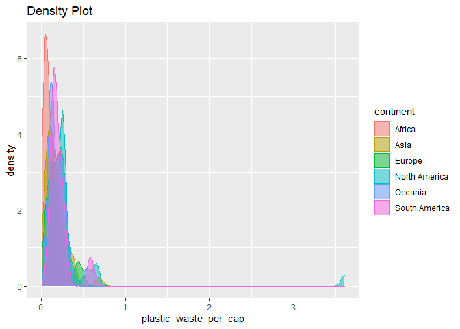
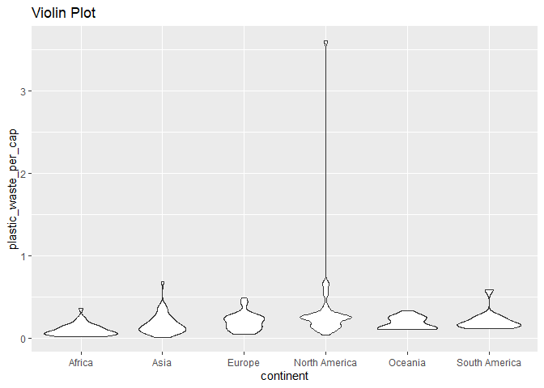
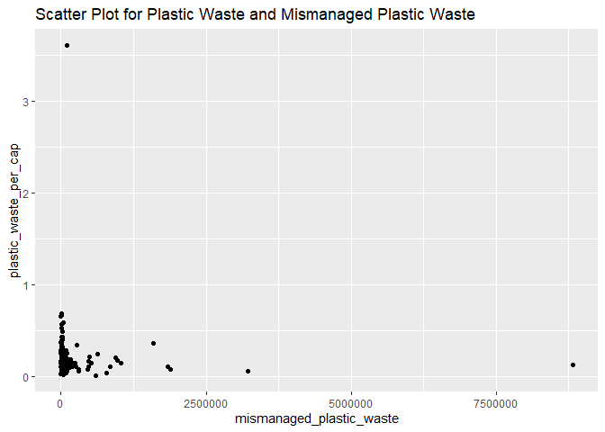
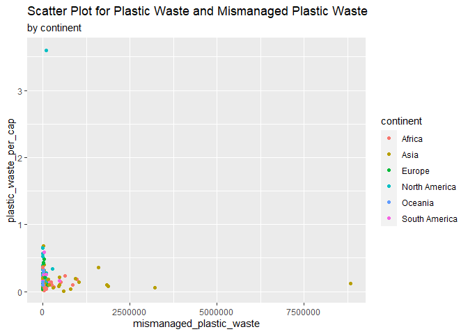
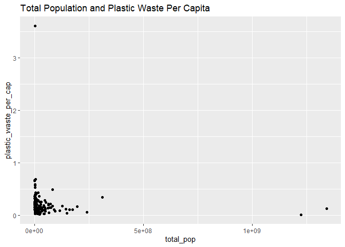
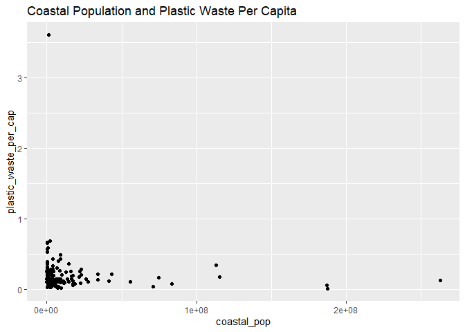
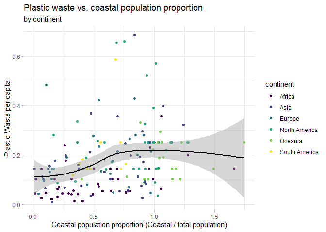

Lab 02 - Plastic waste
================
Insert your name here
Insert date here

## Load packages and data

``` r
library(tidyverse) 
```

``` r
plastic_waste <- read_csv("data/plastic-waste.csv")
```

## Exercises

### Exercise 1

``` r
ggplot(data = plastic_waste, 
       aes(x = plastic_waste_per_cap, fill = continent))+
  geom_histogram()+
facet_wrap (~continent, nrow = 3)+
labs(
  title = "Histogram"
)
```

    ## `stat_bin()` using `bins = 30`. Pick better value with `binwidth`.

    ## Warning: Removed 51 rows containing non-finite values (stat_bin).

<!-- -->

Africa seems to have the lowest plastic waste per capita. North America
have relatively higher plastic waste per capita compared to other
continents.

### Exercise 2

``` r
ggplot(data = plastic_waste, 
       mapping = aes(x = plastic_waste_per_cap, 
                     color = continent, 
                     fill = continent)) +
  geom_density(alpha = 0.5)+
  labs(
    title = "Density Plot"
  )
```

    ## Warning: Removed 51 rows containing non-finite values (stat_density).

<!-- -->

### Exercise 3

Color and fill are aesthetic of the plot because it adds extra elements
into the plot. For example, without color/fill= continent, we will have
single line instead of multiple lines that are drawn based on different
continent. It’s like adding eyes on a face.

Alpha, however, does not add extra elements but helps you to adjust the
appearance of the plot. It’s like adjusting the size of eyes on a face.

### Exercise 4

``` r
ggplot(data = plastic_waste, 
       mapping = aes(x = continent, 
                     y = plastic_waste_per_cap)) +
  geom_violin()+
  labs(
    title = "Violin Plot"
  )
```

    ## Warning: Removed 51 rows containing non-finite values (stat_ydensity).

<!-- -->

##### What do the violin plots reveal that box plots do not? What features are apparent in the box plots but not in the violin plots?

Violin plots show the shape of distributions of each continents, which
box plots don’t. But box plots clearly show the mean and SD, which
violin plots don’t.

### Exercise 5

``` r
ggplot(data = plastic_waste, 
       mapping = aes(x = mismanaged_plastic_waste, 
                     y = plastic_waste_per_cap)) +
  geom_point()+
  labs(
    title="Scatter Plot for Plastic Waste and Mismanaged Plastic Waste"
  )
```

    ## Warning: Removed 51 rows containing missing values (geom_point).

<!-- -->

No clear pattern to indicate the relationship between plastic waste per
capita and mismanaged plastic waste per capita.

### Exercise 6

``` r
ggplot(data = plastic_waste, 
       mapping = aes(x = mismanaged_plastic_waste, 
                     y = plastic_waste_per_cap,
                     color = continent)) +
  geom_point()+
  labs(
    title="Scatter Plot for Plastic Waste and Mismanaged Plastic Waste",
    subtitle = "by continent"
  )
```

    ## Warning: Removed 51 rows containing missing values (geom_point).

<!-- -->

### Exercise 7

``` r
ggplot(data = plastic_waste, 
       mapping = aes(x = total_pop, 
                     y = plastic_waste_per_cap)) +
  geom_point()+
  labs(
    title="Total Population and Plastic Waste Per Capita"
  )
```

    ## Warning: Removed 61 rows containing missing values (geom_point).

<!-- -->

``` r
ggplot(data = plastic_waste, 
       mapping = aes(x = coastal_pop, 
                     y = plastic_waste_per_cap)) +
  geom_point()+
  labs(
    title="Coastal Population and Plastic Waste Per Capita"
  )
```

    ## Warning: Removed 51 rows containing missing values (geom_point).

<!-- -->

None of these pairs of variables appear strong linear association.

### Exercise 8

``` r
ggplot(data = plastic_waste %>%
         filter (plastic_waste_per_cap < 3),
       mapping = aes(x = coastal_pop/total_pop, 
                     y = plastic_waste_per_cap,
                     color = continent)) +
  geom_point()+
  scale_color_viridis_d()+
  stat_smooth(color = "black")+
  labs(
    x = "Coastal population proportion (Coastal / total population)",
    y = "Plastic Waste per capita",
    fill = "Continent",
    title="Plastic waste vs. coastal population proportion",
    subtitle = "by continent")+
theme_light()+
theme(
  panel.border = element_blank(),
  panel.grid.major = element_line(size = 0.5, linetype = 'solid',
                                colour = "grey90"), 
  panel.grid.minor = element_line(size = 0.2, linetype = 'solid',
                                colour = "grey90")
)
```

    ## `geom_smooth()` using method = 'loess' and formula 'y ~ x'

    ## Warning: Removed 10 rows containing non-finite values (stat_smooth).

    ## Warning: Removed 10 rows containing missing values (geom_point).

<!-- -->
